# SPECGUARD Installation Workflow v2.1
## Solo & Team Installation Process - FINAL SPECIFICATION

---

## 🔄 WORKFLOW OVERVIEW

```mermaid
flowchart TD
    START([Technician Scans Trailer]) --> LOOKUP[Asset ID Lookup in Trailer DB]
    LOOKUP --> DISPLAY[Display Trailer Info & Device Type<br/>StealthNet or StealthNet++]
    DISPLAY --> QUESTION{Solo or Team<br/>Installation?}
    
    QUESTION -->|SOLO| SOLO_FLOW[Standard Sequential Flow]
    QUESTION -->|TEAM| TEAM_FLOW[Phase/Step Selection Flow]
    
    SOLO_FLOW --> PHASE1_SOLO[Phase 1: Documentation]
    PHASE1_SOLO --> PHASE2_SOLO[Phase 2: Undercarriage]
    PHASE2_SOLO --> PHASE3_SOLO[Phase 3: Camera & Sensor]
    PHASE3_SOLO --> TECHASSIST_SOLO[Tech Assist Screenshot]
    TECHASSIST_SOLO --> DELAYS_SOLO[Enter Delay Notes]
    DELAYS_SOLO --> COMPLETE_SOLO([Installation Complete ✓])
    
    TEAM_FLOW --> SELECT_WORK[Display All Phases & Steps<br/>Tech Selects ANY Portions]
    SELECT_WORK --> PERFORM_SELECTED[Perform Selected Work]
    PERFORM_SELECTED --> VERIFY_SCAN{Installation Verification<br/>Scan Required}
    VERIFY_SCAN --> CAPTURE_VERIFY[Photo: Install Labels + VIN + VIN Plate<br/>OCR Cross-Check Against DB]
    CAPTURE_VERIFY --> CLOSEOUT{Performing Tech Assist<br/>Documentation?}
    
    CLOSEOUT -->|YES| TECHASSIST_TEAM[Capture Tech Assist Screenshot]
    TECHASSIST_TEAM --> FINAL_CHECK{All Required Work<br/>Complete?}
    
    CLOSEOUT -->|NO| PARTIAL[Mark as Partial Install<br/>Save Tech's Contribution]
    PARTIAL --> WAIT([Awaiting Other Techs])
    
    FINAL_CHECK -->|YES| COMPLETE_TEAM([Installation Complete ✓])
    FINAL_CHECK -->|NO| PARTIAL
```



---

## 📋 KEY WORKFLOW RULES

### Team Installation Rules

| Rule | Description |
|------|-------------|
| **Flexible Selection** | Techs can choose ANY combination of phases/steps (not limited to full phases) |
| **No Mid-Phase Handoff** | Once a tech starts a step, they complete it (no handoffs mid-step) |
| **Out-of-Order Allowed** | Phases CAN be done in any order (Phase 3 can start before Phase 2) |
| **Verification Scan Required** | EVERY team install tech must do verification scan at closeout |
| **Cross-Check Validation** | Verification scan OCR compared against DB to catch mis-scans |
| **No Team Lead** | All techs are equal - no special designation needed |

### Verification Scan (Team Install Closeout)
Every technician closing out a team install portion MUST capture:
1. **Close-up of Installation Labels** → OCR extracts IMEI, MAC, M/N
2. **Close-up of VIN** → OCR extracts VIN
3. **Overall VIN Plate + Labels** → Location verification

**Purpose:** Cross-reference against existing DB records to catch OCR errors from initial scan.

---

## 📊 PHASE & STEP BREAKDOWN

### Phase 1: Documentation & Identification
| Step ID | Step Name | Description | Can Select Individually |
|---------|-----------|-------------|------------------------|
| 1.1 | Asset ID Confirmation | Verify Asset ID from scan | ✅ Yes |
| 1.2 | Installation Stickers Photo | Capture IMEI, MAC, M/N (OCR) | ✅ Yes |
| 1.3 | VIN Close-up Photo | Capture VIN (OCR + Validation) | ✅ Yes |
| 1.4 | Overall Documentation Photo | VIN Plate + Stickers location | ✅ Yes |

### Phase 2: Undercarriage Installation
| Step ID | Step Name | Description | Can Select Individually |
|---------|-----------|-------------|------------------------|
| 2.1 | Gateway Installation | Mount gateway unit | ✅ Yes |
| 2.2 | ABS Connection | Connect to ABS system | ✅ Yes |
| 2.3 | Alternate Power Supply | Turn signal marker install | ✅ Yes |
| 2.4 | Undercarriage Documentation | Completion photos | ✅ Yes |

### Phase 3: External Components
| Step ID | Step Name | Description | Can Select Individually |
|---------|-----------|-------------|------------------------|
| 3.1 | Camera Installation | Mount and align camera | ✅ Yes |
| 3.2 | Door Sensor Installation | Install door sensor | ✅ Yes |
| 3.3 | Tech Assist Capture | Screenshot of connectivity | ⚠️ Final closeout only |
| 3.4 | Delay Notes | Document any delays | ✅ Yes |

---

## 👥 TEAM INSTALLATION SCENARIOS

### Scenario A: Two Techs Split by Location
```
Tech A (Outside): Phase 1 (Documentation) + Phase 3 (Camera/Sensor)
Tech B (Under):   Phase 2 (Undercarriage) + Tech Assist Closeout
```

### Scenario B: Three Techs, One Phase Each
```
Tech A: Phase 1 only → Partial closeout
Tech B: Phase 2 only → Partial closeout  
Tech C: Phase 3 + Tech Assist → Final closeout
```

### Scenario C: Two Techs, Mixed Steps
```
Tech A: Steps 1.1, 1.2, 2.1, 2.2 → Partial closeout
Tech B: Steps 1.3, 1.4, 2.3, 2.4, 3.1, 3.2, 3.3, 3.4 + Tech Assist → Final closeout
```

### Scenario D: Phases Done Out of Order
```
Tech A: Phase 3 (Camera/Sensor) → Partial closeout (starts first!)
Tech B: Phase 2 (Undercarriage) → Partial closeout
Tech C: Phase 1 (Documentation) + Tech Assist → Final closeout
```
*All scenarios valid - system tracks what's done, not the order*

---

## 🗄️ DATA MODEL

### `installation_records` Table

```sql
CREATE TABLE installation_records (
    id UUID PRIMARY KEY DEFAULT gen_random_uuid(),
    
    -- Trailer Reference
    asset_id VARCHAR(50) NOT NULL,
    trailer_id UUID REFERENCES trailers(id),
    
    -- Installation Classification
    installation_type VARCHAR(10) NOT NULL CHECK (installation_type IN ('solo', 'team')),
    installation_group_id UUID, -- Links all records for same trailer install session
    
    -- Technician Info
    technician_id UUID REFERENCES profiles(id) NOT NULL,
    technician_name VARCHAR(100),
    
    -- Work Selection (flexible - phases OR individual steps)
    work_selected JSONB NOT NULL, 
    -- Examples:
    -- Solo: {"type": "full", "phases": ["1", "2", "3"]}
    -- Team: {"type": "partial", "steps": ["1.1", "1.2", "2.1", "2.2"]}
    -- Team: {"type": "partial", "phases": ["3"]}
    
    steps_completed JSONB, -- Tracks completion of each selected step
    
    -- Timing (NO VISIBLE TIMER - tracked in background)
    started_at TIMESTAMPTZ NOT NULL DEFAULT NOW(),
    completed_at TIMESTAMPTZ,
    cycle_time_seconds INTEGER GENERATED ALWAYS AS (
        EXTRACT(EPOCH FROM (completed_at - started_at))
    ) STORED,
    
    -- Status
    status VARCHAR(20) DEFAULT 'in_progress' CHECK (
        status IN ('in_progress', 'partial', 'complete')
    ),
    
    -- Verification Scan (REQUIRED for team installs)
    verification_scan JSONB,
    -- {
    --   "labels_photo_url": "...",
    --   "vin_closeup_url": "...",
    --   "overall_photo_url": "...",
    --   "ocr_results": {
    --     "imei": "...",
    --     "mac": "...",
    --     "vin": "...",
    --     "cross_check_passed": true/false,
    --     "discrepancies": []
    --   }
    -- }
    
    -- Tech Assist (only for final closeout)
    is_final_closeout BOOLEAN DEFAULT FALSE,
    tech_assist_photo_url TEXT,
    
    -- Delay Documentation
    delay_notes TEXT,
    
    -- Photos for each step
    photos JSONB,
    
    -- Metadata
    created_at TIMESTAMPTZ DEFAULT NOW(),
    updated_at TIMESTAMPTZ DEFAULT NOW(),
    
    -- Constraints
    CONSTRAINT team_install_requires_verification CHECK (
        installation_type = 'solo' OR verification_scan IS NOT NULL OR status = 'in_progress'
    )
);

-- Indexes
CREATE INDEX idx_records_asset ON installation_records(asset_id);
CREATE INDEX idx_records_group ON installation_records(installation_group_id);
CREATE INDEX idx_records_tech ON installation_records(technician_id);
CREATE INDEX idx_records_status ON installation_records(status);
```

### Installation Completion Logic

```sql
CREATE OR REPLACE FUNCTION check_installation_complete(p_group_id UUID)
RETURNS BOOLEAN AS $$
DECLARE
    all_steps_done BOOLEAN;
    has_tech_assist BOOLEAN;
    required_steps TEXT[] := ARRAY[
        '1.1', '1.2', '1.3', '1.4',  -- Phase 1
        '2.1', '2.2', '2.3', '2.4',  -- Phase 2
        '3.1', '3.2'                  -- Phase 3 (3.3 is Tech Assist, 3.4 is optional notes)
    ];
    completed_steps TEXT[];
BEGIN
    -- Get all completed steps across all techs for this install
    SELECT array_agg(DISTINCT step)
    INTO completed_steps
    FROM installation_records r,
         jsonb_array_elements_text(r.steps_completed) AS step
    WHERE r.installation_group_id = p_group_id;
    
    -- Check if all required steps are done
    all_steps_done := required_steps <@ completed_steps;
    
    -- Check if Tech Assist was captured
    SELECT EXISTS(
        SELECT 1 FROM installation_records
        WHERE installation_group_id = p_group_id
        AND tech_assist_photo_url IS NOT NULL
    ) INTO has_tech_assist;
    
    RETURN all_steps_done AND has_tech_assist;
END;
$$ LANGUAGE plpgsql;
```

---

## ⏱️ CYCLE TIME TRACKING & KPIs

### Timer Display
- **REMOVED from UI** - Technicians do NOT see a running timer
- **Still tracked in background** - `started_at` and `completed_at` recorded automatically

### Cycle Time Definitions

| Metric | Calculation | Used For |
|--------|-------------|----------|
| **Trailer Total Cycle Time** | First tech `started_at` → Last tech `completed_at` | Customer reporting, Team KPIs |
| **Individual Tech Cycle Time** | Tech's `started_at` → Tech's `completed_at` | Individual performance |
| **Phase/Step Cycle Time** | Time spent on specific work selected | Bottleneck analysis |

### KPI Structure

```sql
-- Example KPI Configuration
CREATE TABLE installation_kpis (
    id UUID PRIMARY KEY DEFAULT gen_random_uuid(),
    kpi_name VARCHAR(100) NOT NULL,
    kpi_type VARCHAR(50) NOT NULL, -- 'solo_total', 'team_total', 'phase', 'step'
    target_minutes INTEGER NOT NULL,
    warning_minutes INTEGER, -- Yellow threshold
    critical_minutes INTEGER, -- Red threshold
    applies_to JSONB, -- {"phases": ["1","2","3"]} or {"steps": ["3.1", "3.2"]}
    branch_id UUID REFERENCES branches(id), -- NULL = all branches
    device_type VARCHAR(50), -- 'stealthnet', 'stealthnet++', or NULL for all
    is_active BOOLEAN DEFAULT TRUE
);

-- Example KPIs
INSERT INTO installation_kpis (kpi_name, kpi_type, target_minutes, warning_minutes, critical_minutes, applies_to) VALUES
('Solo Full Install', 'solo_total', 45, 50, 60, '{"phases": ["1","2","3"]}'),
('Team Full Install', 'team_total', 35, 40, 50, '{"phases": ["1","2","3"]}'),
('Camera + Sensor Only', 'step', 12, 15, 20, '{"steps": ["3.1", "3.2"]}'),
('Undercarriage Only', 'phase', 20, 25, 30, '{"phases": ["2"]}');
```

---

## 📊 REPORTING REQUIREMENTS

### 1. Customer Report (PCT / Xtra Lease)
| Data Point | Description |
|------------|-------------|
| Total Installations | Count of completed trailers |
| Average Cycle Time | Mean time from start to complete (all techs combined) |
| Installation Status | Complete / Partial / Not Started |
| Date/Time Completed | When Tech Assist was captured |

**Does NOT include:** Individual technician breakdown

### 2. Internal Report - Trailer View (MIS)
| Data Point | Description |
|------------|-------------|
| Asset ID | Trailer identifier |
| Total Cycle Time | All techs combined, start to finish |
| Techs Involved | List of all technicians who worked on it |
| Tech Breakdown | Which tech did which phases/steps |
| Per-Tech Time | How long each tech spent |
| Verification Cross-Check | Pass/Fail on OCR validation |

### 3. Internal Report - Technician View (MIS)
| Data Point | Description |
|------------|-------------|
| Technician Name | Tech identifier |
| Installs Completed | Solo + Team contributions |
| Solo Cycle Times | Cradle-to-grave times for solo installs |
| Team Contributions | Phases/steps performed in team installs |
| Phase-Specific Times | Average time for each type of work |
| KPI Performance | Against defined targets |

### Sample Query: Trailer Installation Detail

```sql
SELECT 
    t.asset_id,
    t.vin,
    t.device_type,
    
    -- Total cycle time (all techs)
    EXTRACT(EPOCH FROM (
        MAX(ir.completed_at) - MIN(ir.started_at)
    )) / 60 AS total_cycle_minutes,
    
    -- Tech breakdown
    jsonb_agg(
        jsonb_build_object(
            'technician', ir.technician_name,
            'work_performed', ir.work_selected,
            'cycle_time_minutes', ir.cycle_time_seconds / 60.0,
            'started_at', ir.started_at,
            'completed_at', ir.completed_at,
            'verification_passed', ir.verification_scan->'ocr_results'->>'cross_check_passed'
        )
        ORDER BY ir.started_at
    ) AS technician_breakdown,
    
    -- Installation type
    CASE 
        WHEN COUNT(DISTINCT ir.technician_id) = 1 THEN 'Solo'
        ELSE 'Team (' || COUNT(DISTINCT ir.technician_id) || ' techs)'
    END AS installation_type
    
FROM trailers t
JOIN installation_records ir ON ir.trailer_id = t.id
WHERE t.asset_id = 'XL-12345'
GROUP BY t.id, t.asset_id, t.vin, t.device_type;
```

### Sample Query: Technician Performance

```sql
SELECT 
    p.full_name AS technician,
    
    -- Solo installs
    COUNT(CASE WHEN ir.installation_type = 'solo' THEN 1 END) AS solo_installs,
    AVG(CASE WHEN ir.installation_type = 'solo' 
        THEN ir.cycle_time_seconds END) / 60.0 AS avg_solo_minutes,
    
    -- Team contributions
    COUNT(CASE WHEN ir.installation_type = 'team' THEN 1 END) AS team_contributions,
    AVG(CASE WHEN ir.installation_type = 'team' 
        THEN ir.cycle_time_seconds END) / 60.0 AS avg_team_contrib_minutes,
    
    -- Work type breakdown
    jsonb_object_agg(
        work_type,
        jsonb_build_object(
            'count', work_count,
            'avg_minutes', avg_time
        )
    ) AS work_breakdown
    
FROM profiles p
JOIN installation_records ir ON ir.technician_id = p.id
CROSS JOIN LATERAL (
    SELECT 
        CASE 
            WHEN ir.work_selected->>'type' = 'full' THEN 'Full Install'
            WHEN ir.work_selected->'phases' ? '1' THEN 'Phase 1'
            WHEN ir.work_selected->'phases' ? '2' THEN 'Phase 2'
            WHEN ir.work_selected->'phases' ? '3' THEN 'Phase 3'
            ELSE 'Mixed Steps'
        END AS work_type,
        COUNT(*) AS work_count,
        AVG(ir.cycle_time_seconds) / 60.0 AS avg_time
) breakdown
WHERE ir.completed_at >= NOW() - INTERVAL '30 days'
GROUP BY p.id, p.full_name;
```

---

## 🔐 VERIFICATION CROSS-CHECK LOGIC

When a team install tech does their verification scan:

```javascript
async function performVerificationCrossCheck(
    scannedData: { imei: string, mac: string, vin: string },
    existingRecord: TrailerRecord
): Promise<VerificationResult> {
    
    const discrepancies = [];
    
    // Compare IMEI
    if (normalizeIMEI(scannedData.imei) !== normalizeIMEI(existingRecord.imei)) {
        discrepancies.push({
            field: 'imei',
            scanned: scannedData.imei,
            existing: existingRecord.imei,
            severity: 'high'
        });
    }
    
    // Compare MAC
    if (normalizeMAC(scannedData.mac) !== normalizeMAC(existingRecord.mac)) {
        discrepancies.push({
            field: 'mac',
            scanned: scannedData.mac,
            existing: existingRecord.mac,
            severity: 'high'
        });
    }
    
    // Compare VIN
    if (normalizeVIN(scannedData.vin) !== normalizeVIN(existingRecord.vin)) {
        discrepancies.push({
            field: 'vin',
            scanned: scannedData.vin,
            existing: existingRecord.vin,
            severity: 'critical'
        });
    }
    
    return {
        cross_check_passed: discrepancies.length === 0,
        discrepancies,
        requires_review: discrepancies.some(d => d.severity === 'critical'),
        timestamp: new Date().toISOString()
    };
}
```

**If discrepancies found:**
1. Flag the installation for QC review
2. Allow tech to proceed but mark as "needs verification"
3. Alert manager/admin of potential data issue

---

## ✅ COMPLETION CHECKLIST

Installation is **COMPLETE** when ALL of the following are TRUE:

```
□ Step 1.1: Asset ID Confirmed
□ Step 1.2: Installation Stickers Photo (IMEI, MAC, M/N captured)
□ Step 1.3: VIN Close-up Photo (VIN captured)
□ Step 1.4: Overall Documentation Photo
□ Step 2.1: Gateway Installed
□ Step 2.2: ABS Connected
□ Step 2.3: Alternate Power Supply Installed
□ Step 2.4: Undercarriage Documentation Photos
□ Step 3.1: Camera Installed
□ Step 3.2: Door Sensor Installed
□ Step 3.3: Tech Assist Screenshot Captured
□ (Team Only) All verification scans passed cross-check

→ If ANY step missing: Status = "PARTIAL"
→ If ALL steps complete + Tech Assist captured: Status = "COMPLETE"
```

---

## 📱 UI MOCKUPS

### Team Install: Work Selection Screen

```
┌─────────────────────────────────────────┐
│  SELECT YOUR WORK                       │
│  Trailer: XL-12345 | StealthNet++       │
│─────────────────────────────────────────│
│                                         │
│  ▼ PHASE 1: Documentation               │
│    ☑ 1.1 Asset ID Confirmation          │
│    ☑ 1.2 Installation Stickers Photo    │
│    ☐ 1.3 VIN Close-up Photo       ✓John │
│    ☐ 1.4 Overall Documentation    ✓John │
│                                         │
│  ▼ PHASE 2: Undercarriage               │
│    ☐ 2.1 Gateway Installation           │
│    ☐ 2.2 ABS Connection                 │
│    ☐ 2.3 Alternate Power Supply         │
│    ☐ 2.4 Undercarriage Docs             │
│                                         │
│  ▼ PHASE 3: External Components         │
│    ☑ 3.1 Camera Installation            │
│    ☑ 3.2 Door Sensor Installation       │
│                                         │
│  ┌─────────────────────────────────┐    │
│  │   START SELECTED WORK (4 items) │    │
│  └─────────────────────────────────┘    │
│                                         │
│  Legend: ✓Name = Completed by that tech │
└─────────────────────────────────────────┘
```

### Team Install: Verification Scan Screen

```
┌─────────────────────────────────────────┐
│  VERIFICATION SCAN REQUIRED             │
│─────────────────────────────────────────│
│                                         │
│  Before closing out, capture:           │
│                                         │
│  ┌─────────────┐  ┌─────────────┐       │
│  │   📷        │  │   📷        │       │
│  │  Labels     │  │  VIN Close  │       │
│  │  Close-up   │  │     up      │       │
│  └─────────────┘  └─────────────┘       │
│       ✓ Done          ✓ Done            │
│                                         │
│  ┌─────────────────────────────┐        │
│  │           📷               │        │
│  │    Overall VIN Plate       │        │
│  │      + Stickers            │        │
│  └─────────────────────────────┘        │
│            ✓ Done                       │
│                                         │
│  ┌─────────────────────────────────┐    │
│  │       VERIFY & CONTINUE         │    │
│  └─────────────────────────────────┘    │
│                                         │
└─────────────────────────────────────────┘
```

---

*Document Version: 2.1 - FINAL*
*Last Updated: January 2025*
*Incorporates all clarifications from stakeholder review*
