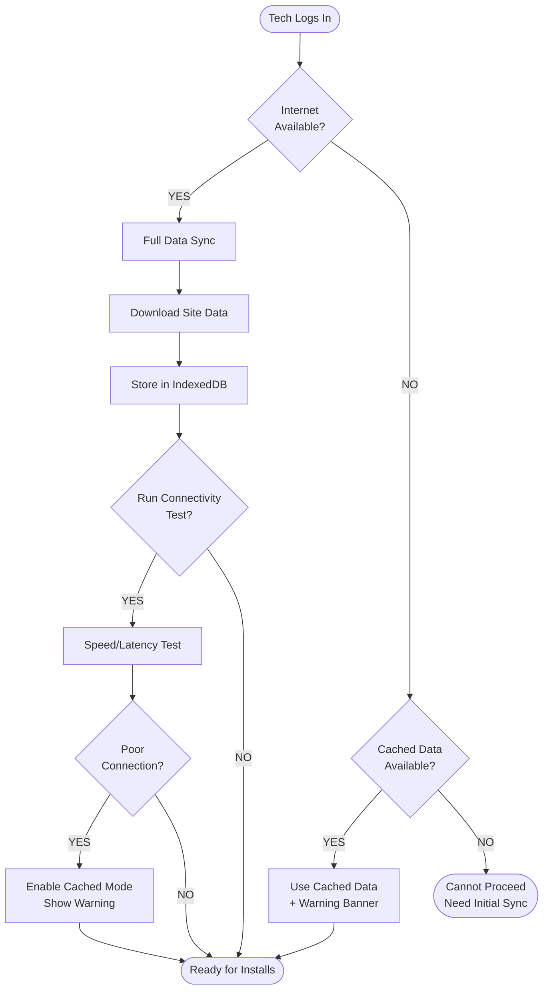
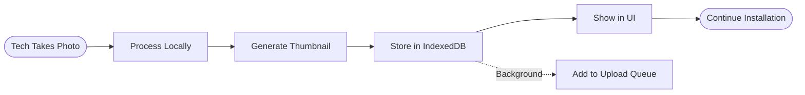

# SPECGUARD Offline-First Architecture Specification
## Version 1.0 - Complete Disconnected Operation Support

---

## 🎯 CORE PRINCIPLE

**The technician's workflow must NEVER be interrupted or slowed down due to connectivity issues.**

Every installation must be completable from start to finish without any network dependency after initial login/sync.

---

## 📱 OFFLINE-FIRST REQUIREMENTS

### 1. Login & Initial Sync



### Data Downloaded on Login/Sync:

| Data | Purpose | Size Estimate |
|------|---------|---------------|
| **Trailers for Site** | Asset lookup, device type | ~1KB per trailer |
| **Installation Templates** | Phase/step configuration | ~10KB total |
| **Validation Rules** | IMEI, MAC, VIN patterns | ~5KB total |
| **Device Inventory** | What's available to install | ~5KB per site |
| **Pending Installs** | Resume capability | ~2KB per pending |
| **User Profile + Prefs** | Language, settings | ~1KB |

**Typical site sync:** ~500KB - 2MB (handles 1000+ trailers)

---

## 💾 LOCAL STORAGE ARCHITECTURE

### IndexedDB Schema

```javascript
// Database: specguard_offline_db

const DB_STORES = {
  // Cached server data
  trailers: {
    keyPath: 'asset_id',
    indexes: ['branch_id', 'status', 'device_type']
  },
  
  // Pending uploads
  pending_installations: {
    keyPath: 'local_id',
    indexes: ['asset_id', 'status', 'created_at']
  },
  
  // Photos awaiting upload
  pending_photos: {
    keyPath: 'local_id',
    indexes: ['installation_id', 'step_id', 'created_at']
  },
  
  // Sync metadata
  sync_status: {
    keyPath: 'id',
    // Tracks last sync time, pending count, etc.
  },
  
  // Validation rules cache
  validation_rules: {
    keyPath: 'rule_type'
  },
  
  // Templates cache
  installation_templates: {
    keyPath: 'template_id'
  }
};
```

### Photo Storage Strategy

```javascript
// Photos stored as Blob in IndexedDB
const photoRecord = {
  local_id: 'photo_uuid_123',
  installation_id: 'install_uuid_456',
  step_id: '2.1',
  
  // Original photo data
  blob: Blob, // Full resolution image
  thumbnail_blob: Blob, // For UI display (compressed)
  
  // Metadata
  file_name: 'gateway_install.jpg',
  original_format: 'HEIC', // Track for conversion
  file_size: 2500000,
  captured_at: '2025-01-10T14:30:00Z',
  
  // Upload status
  upload_status: 'pending', // 'pending' | 'uploading' | 'uploaded' | 'failed'
  upload_attempts: 0,
  last_upload_attempt: null,
  
  // Local device save (nice-to-have)
  saved_to_device: false,
  device_path: null
};
```

---

## 📷 PHOTO HANDLING

### Capture Flow (NO Real-Time Upload)



### HEIC Conversion Strategy

| Stage | Action | Location |
|-------|--------|----------|
| **Capture** | Store original HEIC | Device/IndexedDB |
| **Display** | Show thumbnail (any format) | Frontend |
| **Upload** | Send original HEIC | Network |
| **Storage** | Convert HEIC → JPEG | **Supabase Edge Function** |
| **Database** | Store JPEG URL | Supabase Storage |

```javascript
// Supabase Edge Function: convert-heic-to-jpeg
import { decode } from 'heic-decode';
import sharp from 'sharp';

export async function convertHeicToJpeg(heicBuffer: ArrayBuffer): Promise<Buffer> {
  // Decode HEIC
  const { width, height, data } = await decode({ buffer: heicBuffer });
  
  // Convert to JPEG using Sharp
  const jpegBuffer = await sharp(data, {
    raw: { width, height, channels: 4 }
  })
    .jpeg({ quality: 85 })
    .toBuffer();
  
  return jpegBuffer;
}
```

### Local Device Save (Nice-to-Have)

```javascript
// Attempt to save to device camera roll / gallery
// This is platform-dependent and may not always work

async function savePhotoToDevice(blob: Blob, filename: string): Promise<boolean> {
  try {
    // Check if File System Access API is available (modern browsers)
    if ('showSaveFilePicker' in window) {
      const handle = await window.showSaveFilePicker({
        suggestedName: filename,
        types: [{
          description: 'Images',
          accept: { 'image/jpeg': ['.jpg', '.jpeg'] }
        }]
      });
      const writable = await handle.createWritable();
      await writable.write(blob);
      await writable.close();
      return true;
    }
    
    // Fallback: Create download link (works on most mobile browsers)
    const url = URL.createObjectURL(blob);
    const a = document.createElement('a');
    a.href = url;
    a.download = filename;
    a.click();
    URL.revokeObjectURL(url);
    return true;
    
  } catch (error) {
    console.warn('Could not save to device:', error);
    return false;
  }
}
```

**iOS Limitation:** Direct camera roll access requires native app (Capacitor/React Native). PWA can only trigger download dialog.

**Android:** Similar limitation, but download folder is more accessible.

**Recommendation:** Implement as "Export Photos" button rather than automatic save.

---

## 🔄 BACKGROUND SYNC ENGINE

### Sync Queue Manager

```javascript
class SyncQueueManager {
  private queue: SyncItem[] = [];
  private isProcessing: boolean = false;
  private retryDelays = [1000, 5000, 15000, 60000, 300000]; // Exponential backoff
  
  // Add item to queue
  async enqueue(item: SyncItem): Promise<void> {
    await this.db.pending_sync.add(item);
    this.processQueue();
  }
  
  // Process queue when connection available
  async processQueue(): Promise<void> {
    if (this.isProcessing || !navigator.onLine) return;
    
    this.isProcessing = true;
    
    const pending = await this.db.pending_sync
      .where('status')
      .equals('pending')
      .sortBy('created_at');
    
    for (const item of pending) {
      try {
        await this.syncItem(item);
        await this.db.pending_sync.update(item.id, { status: 'completed' });
      } catch (error) {
        await this.handleSyncError(item, error);
      }
    }
    
    this.isProcessing = false;
  }
  
  // Listen for connection changes
  setupListeners(): void {
    window.addEventListener('online', () => this.processQueue());
    
    // Also try periodically
    setInterval(() => this.processQueue(), 30000);
  }
}
```

### Sync Priority Order

```
PRIORITY 1 (Critical): Installation Records
  → Must sync before end of day
  → Affects customer billing/reporting

PRIORITY 2 (High): Photos
  → Large files, sync when stable connection
  → Can retry multiple times

PRIORITY 3 (Medium): Scan Logs
  → Historical data, less time-sensitive

PRIORITY 4 (Low): Analytics/Telemetry
  → Can wait, no business impact
```

---

## 🧪 CONNECTIVITY TEST FUNCTION

### User Settings: Test Connectivity

```javascript
interface ConnectivityTestResult {
  timestamp: string;
  overall_status: 'good' | 'fair' | 'poor' | 'offline';
  
  // Individual metrics
  latency_ms: number;
  download_speed_mbps: number;
  upload_speed_mbps: number;
  packet_loss_percent: number;
  
  // Recommendations
  recommended_mode: 'online' | 'cached';
  warnings: string[];
}

async function runConnectivityTest(): Promise<ConnectivityTestResult> {
  const results: ConnectivityTestResult = {
    timestamp: new Date().toISOString(),
    overall_status: 'offline',
    latency_ms: 0,
    download_speed_mbps: 0,
    upload_speed_mbps: 0,
    packet_loss_percent: 0,
    recommended_mode: 'cached',
    warnings: []
  };
  
  if (!navigator.onLine) {
    results.warnings.push('Device is offline');
    return results;
  }
  
  try {
    // Test 1: Latency (ping Supabase)
    const pingStart = performance.now();
    await fetch(`${SUPABASE_URL}/rest/v1/`, { method: 'HEAD' });
    results.latency_ms = performance.now() - pingStart;
    
    // Test 2: Download speed (fetch small file)
    const downloadStart = performance.now();
    const response = await fetch(`${SUPABASE_URL}/storage/v1/object/public/test/speed-test-100kb.bin`);
    const blob = await response.blob();
    const downloadTime = (performance.now() - downloadStart) / 1000;
    results.download_speed_mbps = (blob.size * 8 / 1000000) / downloadTime;
    
    // Test 3: Upload speed (post small payload)
    const testPayload = new Blob([new ArrayBuffer(50000)]); // 50KB
    const uploadStart = performance.now();
    await fetch(`${SUPABASE_URL}/functions/v1/connectivity-test`, {
      method: 'POST',
      body: testPayload
    });
    const uploadTime = (performance.now() - uploadStart) / 1000;
    results.upload_speed_mbps = (50000 * 8 / 1000000) / uploadTime;
    
    // Evaluate results
    if (results.latency_ms < 200 && results.upload_speed_mbps > 1) {
      results.overall_status = 'good';
      results.recommended_mode = 'online';
    } else if (results.latency_ms < 500 && results.upload_speed_mbps > 0.5) {
      results.overall_status = 'fair';
      results.recommended_mode = 'online';
      results.warnings.push('Connection is slow - photos may take longer to upload');
    } else {
      results.overall_status = 'poor';
      results.recommended_mode = 'cached';
      results.warnings.push('Poor connection detected - switching to cached mode');
      results.warnings.push('Your installations will sync when connection improves');
    }
    
  } catch (error) {
    results.overall_status = 'offline';
    results.recommended_mode = 'cached';
    results.warnings.push('Could not connect to server');
  }
  
  return results;
}
```

### UI Display

```
┌─────────────────────────────────────────┐
│  ⚙️ CONNECTION TEST                     │
│─────────────────────────────────────────│
│                                         │
│  Status: ⚠️ FAIR CONNECTION             │
│                                         │
│  Latency:    340ms (acceptable)         │
│  Download:   2.1 Mbps ✓                 │
│  Upload:     0.8 Mbps ⚠️                │
│                                         │
│  ┌─────────────────────────────────┐    │
│  │ ⚠️ RECOMMENDATION               │    │
│  │                                 │    │
│  │ Connection is usable but slow. │    │
│  │ Photos may take longer to sync.│    │
│  │                                 │    │
│  │ You can work normally - data   │    │
│  │ will sync in background.       │    │
│  └─────────────────────────────────┘    │
│                                         │
│  [Run Test Again]    [Continue]         │
│                                         │
└─────────────────────────────────────────┘
```

---

## 🔒 END-OF-DAY SYNC VERIFICATION

### Logout Check

```javascript
async function handleLogout(): Promise<void> {
  const pendingCount = await getPendingSyncCount();
  
  if (pendingCount > 0) {
    const confirmed = await showDialog({
      title: '⚠️ Pending Uploads',
      message: `You have ${pendingCount} items waiting to sync:
        - ${pendingInstallations} installation records
        - ${pendingPhotos} photos
        
        These will be lost if you log out now.
        
        Would you like to:`,
      options: [
        { label: 'Try Sync Now', action: 'sync' },
        { label: 'Logout Anyway', action: 'logout', danger: true },
        { label: 'Cancel', action: 'cancel' }
      ]
    });
    
    if (confirmed === 'sync') {
      await forceSyncAll();
      // Re-check and show results
    } else if (confirmed === 'logout') {
      // Log out but preserve local data for next login
      await preserveLocalDataForNextSession();
      await performLogout();
    }
  } else {
    await performLogout();
  }
}
```

### Automatic Idle Sync (2-Hour Inactivity Check)

```javascript
class IdleSyncManager {
  private lastActivityTime: number = Date.now();
  private idleThreshold: number = 2 * 60 * 60 * 1000; // 2 hours
  private checkInterval: number = 5 * 60 * 1000; // Check every 5 minutes
  
  constructor() {
    // Track user activity
    ['click', 'touch', 'keypress', 'scroll'].forEach(event => {
      document.addEventListener(event, () => this.recordActivity());
    });
    
    // Start idle checker
    setInterval(() => this.checkIdleSync(), this.checkInterval);
  }
  
  recordActivity(): void {
    this.lastActivityTime = Date.now();
  }
  
  async checkIdleSync(): Promise<void> {
    const idleTime = Date.now() - this.lastActivityTime;
    
    if (idleTime >= this.idleThreshold) {
      console.log('User idle for 2+ hours, checking for pending sync...');
      
      const pendingCount = await getPendingSyncCount();
      
      if (pendingCount > 0 && navigator.onLine) {
        console.log(`Found ${pendingCount} pending items, initiating sync...`);
        
        // Show subtle notification (don't interrupt if they come back)
        showBackgroundSyncNotification('Syncing your data...');
        
        await forceSyncAll();
        
        showBackgroundSyncNotification('All data synced ✓');
      }
    }
  }
}
```

### Scheduled Sync Windows

```javascript
// Also sync at specific times (e.g., end of typical work day)
class ScheduledSyncManager {
  private syncTimes = ['17:00', '19:00', '21:00']; // 5pm, 7pm, 9pm
  
  constructor() {
    this.scheduleNextSync();
  }
  
  scheduleNextSync(): void {
    const now = new Date();
    const nextSyncTime = this.getNextSyncTime(now);
    const delay = nextSyncTime.getTime() - now.getTime();
    
    setTimeout(async () => {
      await this.performScheduledSync();
      this.scheduleNextSync(); // Schedule next one
    }, delay);
  }
  
  async performScheduledSync(): Promise<void> {
    const pendingCount = await getPendingSyncCount();
    
    if (pendingCount > 0) {
      // Check connection quality first
      const connectivity = await runConnectivityTest();
      
      if (connectivity.overall_status !== 'offline') {
        await forceSyncAll();
        
        // Notify user if they're active
        if (document.visibilityState === 'visible') {
          showNotification({
            title: 'Scheduled Sync Complete',
            message: `${pendingCount} items synced successfully`
          });
        }
      }
    }
  }
}
```

---

## 📊 SYNC STATUS DASHBOARD

### Technician View (Always Visible)

```
┌──────────────────────────────────────────────┐
│  📡 SYNC STATUS                    [Refresh] │
├──────────────────────────────────────────────┤
│                                              │
│  Connection: 🟢 Online (Good)                │
│  Last Sync:  2 minutes ago                   │
│                                              │
│  Pending:                                    │
│    📋 Installations: 0 ✓                     │
│    📷 Photos: 3 uploading...                 │
│    📝 Scan Logs: 0 ✓                         │
│                                              │
│  Today's Activity:                           │
│    ✓ 12 installations synced                 │
│    ✓ 47 photos uploaded                      │
│                                              │
└──────────────────────────────────────────────┘
```

### Warning States

```
🟢 All Synced     - Everything uploaded
🟡 Syncing        - Upload in progress  
🟠 Pending        - Items waiting (offline or queued)
🔴 Sync Failed    - Errors need attention
⚪ Offline Mode   - Working from cache
```

---

## 🛡️ DATA PRESERVATION GUARANTEES

### What We GUARANTEE:

1. **No Data Loss** - All installation data stored locally first
2. **No Interruption** - Tech can complete full install offline
3. **Automatic Recovery** - Sync resumes when connection returns
4. **Retry Logic** - Failed uploads retry with exponential backoff
5. **Cross-Session Persistence** - Data survives app close/reopen

### Storage Quotas (Browser Limits)

| Browser | IndexedDB Limit | Adequate? |
|---------|-----------------|-----------|
| Chrome/Edge | 60% of disk | ✅ Yes |
| Firefox | 50% of disk (max 2GB) | ✅ Yes |
| Safari iOS | 1GB per origin | ⚠️ Monitor |
| Safari macOS | Unlimited (with prompt) | ✅ Yes |

**Mitigation for Safari iOS:**
- Compress photos before storing
- Clear successfully synced data promptly
- Warn user if approaching limit

---

## 📱 PLATFORM-SPECIFIC NOTES

### iOS (iPhone/iPad)

| Feature | Support | Notes |
|---------|---------|-------|
| IndexedDB | ✅ Yes | Safari supports well |
| Background Sync | ⚠️ Limited | Only when app is open |
| HEIC Photos | ✅ Native | Convert on backend |
| Save to Camera Roll | ❌ PWA | Requires native app |
| Push Notifications | ⚠️ iOS 16.4+ | Requires user permission |

### Android

| Feature | Support | Notes |
|---------|---------|-------|
| IndexedDB | ✅ Yes | Chrome supports well |
| Background Sync | ✅ Better | Service worker support |
| HEIC Photos | ⚠️ Rare | Most use JPEG anyway |
| Save to Downloads | ✅ Yes | Via download API |
| Push Notifications | ✅ Yes | Full support |

---

## ✅ IMPLEMENTATION CHECKLIST

### Must Have (P0)

- [ ] IndexedDB storage for all installation data
- [ ] Offline trailer lookup from cached data
- [ ] Photo storage in IndexedDB (not real-time upload)
- [ ] Background sync queue manager
- [ ] HEIC → JPEG conversion on Supabase Edge Function
- [ ] Logout sync verification check
- [ ] Online/offline status indicator
- [ ] Pending upload counter

### Should Have (P1)

- [ ] Connectivity test function in settings
- [ ] 2-hour idle auto-sync
- [ ] Scheduled sync windows
- [ ] Sync status dashboard
- [ ] Exponential backoff retry logic

### Nice to Have (P2)

- [ ] Export photos to device storage
- [ ] Push notifications for sync status
- [ ] Bandwidth usage tracking
- [ ] Sync history log

---

*Document Version: 1.0*
*Last Updated: January 2025*
*Author: SPECGUARD Architecture Team*
