# SPECGUARD Photo Auto-Enhancement Specification
## Automatic Image Quality Optimization Pipeline

---

## 🎯 OBJECTIVE

Every photo stored in the database must be automatically enhanced to ensure optimal quality for:
- Customer review (PCT, Xtra Lease)
- OCR accuracy (VIN, IMEI, MAC extraction)
- QC analysis (AI-powered quality checks)
- Long-term documentation

---

## 📸 PHOTO PROCESSING PIPELINE

```mermaid
flowchart LR
    CAPTURE([Photo Captured]) --> STORE_LOCAL[Store Original<br/>in IndexedDB]
    STORE_LOCAL --> QUEUE[Add to Upload Queue]
    
    QUEUE --> UPLOAD[Upload to<br/>Supabase Storage]
    UPLOAD --> EDGE[Supabase Edge Function]
    
    subgraph EDGE_PROCESSING [Edge Function Processing]
        EDGE --> HEIC{HEIC<br/>Format?}
        HEIC -->|YES| CONVERT[Convert to JPEG]
        HEIC -->|NO| ANALYZE
        CONVERT --> ANALYZE[Analyze Image Quality]
        
        ANALYZE --> DARK{Too Dark?<br/>Brightness < 40}
        DARK -->|YES| BRIGHTEN[Auto-Brighten]
        DARK -->|NO| CONTRAST
        
        BRIGHTEN --> CONTRAST{Low Contrast?<br/>StdDev < 50}
        CONTRAST -->|YES| ENHANCE_CONTRAST[Enhance Contrast]
        CONTRAST -->|NO| SHARP
        
        ENHANCE_CONTRAST --> SHARP{Slightly Blurry?<br/>Laplacian < 100}
        SHARP -->|YES| SHARPEN[Apply Sharpening]
        SHARP -->|NO| SAVE
        
        SHARPEN --> SAVE[Save Enhanced Image]
    end
    
    SAVE --> STORE_DB[(Store in Supabase<br/>Storage Bucket)]
    STORE_DB --> URL[Return Enhanced<br/>Image URL]
```



---

## 🔧 ENHANCEMENT OPERATIONS

### 1. Brightness Correction (Auto-Brighten Dark Photos)

```javascript
// Detect if image is too dark
function analyzeBrightness(imageData: ImageData): number {
  let totalBrightness = 0;
  const pixels = imageData.data;
  
  for (let i = 0; i < pixels.length; i += 4) {
    // Calculate perceived brightness (human eye weighted)
    const brightness = (
      0.299 * pixels[i] +     // Red
      0.587 * pixels[i + 1] + // Green
      0.114 * pixels[i + 2]   // Blue
    );
    totalBrightness += brightness;
  }
  
  return totalBrightness / (pixels.length / 4); // 0-255 scale
}

// Thresholds
const BRIGHTNESS_THRESHOLDS = {
  TOO_DARK: 40,      // Below this = definitely too dark
  DARK: 70,          // Below this = somewhat dark
  OPTIMAL_MIN: 90,   // Target minimum
  OPTIMAL_MAX: 180,  // Target maximum
  BRIGHT: 200,       // Above this = somewhat bright
  TOO_BRIGHT: 230    // Above this = overexposed
};
```

### 2. Contrast Enhancement

```javascript
// Detect low contrast images
function analyzeContrast(imageData: ImageData): number {
  const brightnessValues: number[] = [];
  const pixels = imageData.data;
  
  for (let i = 0; i < pixels.length; i += 4) {
    const brightness = (pixels[i] + pixels[i + 1] + pixels[i + 2]) / 3;
    brightnessValues.push(brightness);
  }
  
  // Calculate standard deviation (measure of contrast)
  const mean = brightnessValues.reduce((a, b) => a + b) / brightnessValues.length;
  const squaredDiffs = brightnessValues.map(v => Math.pow(v - mean, 2));
  const avgSquaredDiff = squaredDiffs.reduce((a, b) => a + b) / squaredDiffs.length;
  const stdDev = Math.sqrt(avgSquaredDiff);
  
  return stdDev; // Higher = more contrast
}

// Thresholds
const CONTRAST_THRESHOLDS = {
  VERY_LOW: 30,    // Needs significant enhancement
  LOW: 50,         // Needs some enhancement
  OPTIMAL: 70,     // Good contrast
  HIGH: 100        // Already high contrast
};
```

### 3. Sharpness Detection (for OCR accuracy)

```javascript
// Detect blur using Laplacian variance
function analyzeSharpness(imageData: ImageData, width: number, height: number): number {
  // Convert to grayscale
  const gray = new Float32Array(width * height);
  const pixels = imageData.data;
  
  for (let i = 0; i < width * height; i++) {
    gray[i] = 0.299 * pixels[i * 4] + 
              0.587 * pixels[i * 4 + 1] + 
              0.114 * pixels[i * 4 + 2];
  }
  
  // Apply Laplacian kernel
  const laplacian: number[] = [];
  for (let y = 1; y < height - 1; y++) {
    for (let x = 1; x < width - 1; x++) {
      const idx = y * width + x;
      const lap = (
        -4 * gray[idx] +
        gray[idx - 1] + gray[idx + 1] +
        gray[idx - width] + gray[idx + width]
      );
      laplacian.push(lap);
    }
  }
  
  // Calculate variance
  const mean = laplacian.reduce((a, b) => a + b) / laplacian.length;
  const variance = laplacian.reduce((a, b) => a + Math.pow(b - mean, 2), 0) / laplacian.length;
  
  return variance; // Higher = sharper
}

// Thresholds
const SHARPNESS_THRESHOLDS = {
  VERY_BLURRY: 50,   // Reject or warn
  BLURRY: 100,       // Apply sharpening
  ACCEPTABLE: 200,   // Slight sharpening optional
  SHARP: 500         // No enhancement needed
};
```

---

## 🖼️ SUPABASE EDGE FUNCTION: Image Processor

```typescript
// supabase/functions/process-installation-photo/index.ts

import { serve } from 'https://deno.land/std@0.168.0/http/server.ts';
import { decode as decodeHeic } from 'npm:heic-decode';
import sharp from 'npm:sharp';

interface ProcessingResult {
  success: boolean;
  original_url: string;
  enhanced_url: string;
  enhancements_applied: string[];
  quality_metrics: {
    original_brightness: number;
    original_contrast: number;
    original_sharpness: number;
    final_brightness: number;
    final_contrast: number;
    final_sharpness: number;
  };
  warnings: string[];
}

serve(async (req) => {
  try {
    const formData = await req.formData();
    const file = formData.get('photo') as File;
    const photoType = formData.get('photo_type') as string; // 'vin', 'sticker', 'installation', etc.
    
    let imageBuffer = Buffer.from(await file.arrayBuffer());
    const enhancements: string[] = [];
    const warnings: string[] = [];
    
    // Step 1: Convert HEIC if needed
    if (file.name.toLowerCase().endsWith('.heic') || file.type === 'image/heic') {
      const decoded = await decodeHeic({ buffer: imageBuffer });
      imageBuffer = await sharp(decoded.data, {
        raw: { width: decoded.width, height: decoded.height, channels: 4 }
      }).jpeg().toBuffer();
      enhancements.push('heic_to_jpeg');
    }
    
    // Step 2: Analyze original image
    const originalMetrics = await analyzeImage(imageBuffer);
    
    // Step 3: Apply enhancements based on analysis
    let sharpInstance = sharp(imageBuffer);
    
    // Brightness correction
    if (originalMetrics.brightness < 40) {
      // Very dark - significant brightening
      sharpInstance = sharpInstance.modulate({ brightness: 1.5 });
      enhancements.push('brightness_boost_high');
    } else if (originalMetrics.brightness < 70) {
      // Somewhat dark - moderate brightening
      sharpInstance = sharpInstance.modulate({ brightness: 1.25 });
      enhancements.push('brightness_boost_moderate');
    } else if (originalMetrics.brightness > 230) {
      // Overexposed - reduce brightness
      sharpInstance = sharpInstance.modulate({ brightness: 0.85 });
      enhancements.push('brightness_reduce');
      warnings.push('Image may be overexposed');
    }
    
    // Contrast enhancement
    if (originalMetrics.contrast < 30) {
      // Very low contrast - significant enhancement
      sharpInstance = sharpInstance.normalize().linear(1.3, -30);
      enhancements.push('contrast_boost_high');
    } else if (originalMetrics.contrast < 50) {
      // Low contrast - moderate enhancement
      sharpInstance = sharpInstance.normalize();
      enhancements.push('contrast_boost_moderate');
    }
    
    // Sharpening (especially important for OCR photos)
    const ocrPhotoTypes = ['vin', 'sticker', 'label', 'imei', 'mac'];
    if (ocrPhotoTypes.includes(photoType)) {
      if (originalMetrics.sharpness < 100) {
        // Blurry OCR photo - aggressive sharpening
        sharpInstance = sharpInstance.sharpen({ sigma: 2, m1: 1, m2: 0.5 });
        enhancements.push('sharpen_high');
        warnings.push('Image was blurry - OCR accuracy may be affected');
      } else if (originalMetrics.sharpness < 200) {
        // Slightly soft - moderate sharpening
        sharpInstance = sharpInstance.sharpen({ sigma: 1.5 });
        enhancements.push('sharpen_moderate');
      }
    } else {
      // Non-OCR photos - lighter sharpening
      if (originalMetrics.sharpness < 100) {
        sharpInstance = sharpInstance.sharpen({ sigma: 1 });
        enhancements.push('sharpen_light');
      }
    }
    
    // Step 4: Apply final quality settings
    const enhancedBuffer = await sharpInstance
      .jpeg({ 
        quality: 85, 
        mozjpeg: true // Better compression
      })
      .toBuffer();
    
    // Step 5: Analyze final image
    const finalMetrics = await analyzeImage(enhancedBuffer);
    
    // Step 6: Upload both original and enhanced to storage
    const timestamp = Date.now();
    const originalPath = `originals/${timestamp}_${file.name}`;
    const enhancedPath = `enhanced/${timestamp}_${file.name.replace(/\.[^.]+$/, '.jpg')}`;
    
    // Upload to Supabase Storage
    const { data: originalUpload } = await supabaseAdmin.storage
      .from('installation-photos')
      .upload(originalPath, imageBuffer, { contentType: 'image/jpeg' });
    
    const { data: enhancedUpload } = await supabaseAdmin.storage
      .from('installation-photos')
      .upload(enhancedPath, enhancedBuffer, { contentType: 'image/jpeg' });
    
    const originalUrl = supabaseAdmin.storage
      .from('installation-photos')
      .getPublicUrl(originalPath).data.publicUrl;
    
    const enhancedUrl = supabaseAdmin.storage
      .from('installation-photos')
      .getPublicUrl(enhancedPath).data.publicUrl;
    
    return new Response(JSON.stringify({
      success: true,
      original_url: originalUrl,
      enhanced_url: enhancedUrl,
      enhancements_applied: enhancements,
      quality_metrics: {
        original_brightness: originalMetrics.brightness,
        original_contrast: originalMetrics.contrast,
        original_sharpness: originalMetrics.sharpness,
        final_brightness: finalMetrics.brightness,
        final_contrast: finalMetrics.contrast,
        final_sharpness: finalMetrics.sharpness
      },
      warnings
    }), {
      headers: { 'Content-Type': 'application/json' }
    });
    
  } catch (error) {
    return new Response(JSON.stringify({
      success: false,
      error: error.message
    }), {
      status: 500,
      headers: { 'Content-Type': 'application/json' }
    });
  }
});

// Helper function to analyze image metrics
async function analyzeImage(buffer: Buffer): Promise<{
  brightness: number;
  contrast: number;
  sharpness: number;
}> {
  const { data, info } = await sharp(buffer)
    .raw()
    .toBuffer({ resolveWithObject: true });
  
  // Calculate brightness
  let totalBrightness = 0;
  const brightnessValues: number[] = [];
  
  for (let i = 0; i < data.length; i += 3) {
    const brightness = 0.299 * data[i] + 0.587 * data[i + 1] + 0.114 * data[i + 2];
    totalBrightness += brightness;
    brightnessValues.push(brightness);
  }
  
  const avgBrightness = totalBrightness / (data.length / 3);
  
  // Calculate contrast (standard deviation)
  const mean = brightnessValues.reduce((a, b) => a + b) / brightnessValues.length;
  const squaredDiffs = brightnessValues.map(v => Math.pow(v - mean, 2));
  const contrast = Math.sqrt(squaredDiffs.reduce((a, b) => a + b) / squaredDiffs.length);
  
  // Estimate sharpness using edge detection
  const { data: grayData } = await sharp(buffer)
    .greyscale()
    .raw()
    .toBuffer({ resolveWithObject: true });
  
  let laplacianSum = 0;
  const width = info.width;
  const height = info.height;
  
  for (let y = 1; y < height - 1; y++) {
    for (let x = 1; x < width - 1; x++) {
      const idx = y * width + x;
      const lap = Math.abs(
        -4 * grayData[idx] +
        grayData[idx - 1] + grayData[idx + 1] +
        grayData[idx - width] + grayData[idx + width]
      );
      laplacianSum += lap * lap;
    }
  }
  
  const sharpness = laplacianSum / ((width - 2) * (height - 2));
  
  return {
    brightness: avgBrightness,
    contrast,
    sharpness
  };
}
```

---

## 📊 ENHANCEMENT PROFILES BY PHOTO TYPE

| Photo Type | Brightness | Contrast | Sharpening | Notes |
|------------|------------|----------|------------|-------|
| **VIN Close-up** | Aggressive | Aggressive | High | OCR critical |
| **Installation Stickers** | Aggressive | Aggressive | High | OCR critical |
| **IMEI/MAC Label** | Aggressive | Aggressive | High | OCR critical |
| **Gateway Install** | Moderate | Moderate | Light | Documentation |
| **ABS Connection** | Moderate | Moderate | Light | Documentation |
| **Camera Mount** | Moderate | Moderate | Light | Documentation |
| **Overall/Wide Shot** | Light | Light | Minimal | Context only |
| **Tech Assist Screen** | Aggressive | High | High | Must be readable |

```typescript
const ENHANCEMENT_PROFILES: Record<string, EnhancementProfile> = {
  vin: {
    brightness_boost: 1.4,
    contrast_multiplier: 1.3,
    sharpen_sigma: 2.0,
    priority: 'ocr_accuracy'
  },
  sticker: {
    brightness_boost: 1.4,
    contrast_multiplier: 1.3,
    sharpen_sigma: 2.0,
    priority: 'ocr_accuracy'
  },
  imei_label: {
    brightness_boost: 1.4,
    contrast_multiplier: 1.3,
    sharpen_sigma: 2.0,
    priority: 'ocr_accuracy'
  },
  tech_assist: {
    brightness_boost: 1.3,
    contrast_multiplier: 1.4,
    sharpen_sigma: 1.5,
    priority: 'readability'
  },
  installation: {
    brightness_boost: 1.2,
    contrast_multiplier: 1.1,
    sharpen_sigma: 1.0,
    priority: 'documentation'
  },
  overview: {
    brightness_boost: 1.1,
    contrast_multiplier: 1.0,
    sharpen_sigma: 0.5,
    priority: 'context'
  }
};
```

---

## 🚨 QUALITY WARNINGS & REJECTION

### Warning Thresholds (Flag for Review)

| Condition | Threshold | Action |
|-----------|-----------|--------|
| Very Dark | Brightness < 25 | Warn: "Photo may be too dark" |
| Very Bright | Brightness > 240 | Warn: "Photo may be overexposed" |
| Very Low Contrast | StdDev < 20 | Warn: "Photo lacks detail" |
| Very Blurry | Laplacian < 50 | Warn: "Photo is blurry" |

### Rejection Thresholds (for OCR photos only)

| Condition | Threshold | Action |
|-----------|-----------|--------|
| Unreadable Dark | Brightness < 15 | Reject: "Cannot enhance - please retake" |
| Completely Blurry | Laplacian < 25 | Reject: "Too blurry for OCR - please retake" |
| No Content | Contrast < 10 | Reject: "Image appears blank - please retake" |

```typescript
function shouldRejectPhoto(metrics: QualityMetrics, photoType: string): {
  reject: boolean;
  reason?: string;
} {
  const ocrTypes = ['vin', 'sticker', 'imei_label', 'mac_label'];
  
  if (ocrTypes.includes(photoType)) {
    if (metrics.brightness < 15) {
      return { reject: true, reason: 'Photo is too dark to enhance. Please retake with better lighting.' };
    }
    if (metrics.sharpness < 25) {
      return { reject: true, reason: 'Photo is too blurry for text reading. Please retake and hold steady.' };
    }
    if (metrics.contrast < 10) {
      return { reject: true, reason: 'Cannot detect any content. Please ensure the label is in frame.' };
    }
  }
  
  return { reject: false };
}
```

---

## 💾 DATABASE STORAGE

### Photo Record Structure

```sql
CREATE TABLE installation_photos (
  id UUID PRIMARY KEY DEFAULT gen_random_uuid(),
  installation_record_id UUID REFERENCES installation_records(id),
  step_id VARCHAR(10) NOT NULL, -- '1.1', '2.3', etc.
  photo_type VARCHAR(50) NOT NULL, -- 'vin', 'sticker', 'installation', etc.
  
  -- URLs
  original_url TEXT, -- Original as captured (backup)
  enhanced_url TEXT NOT NULL, -- Enhanced version (primary)
  thumbnail_url TEXT, -- For quick loading in lists
  
  -- Quality Metrics (stored for analytics)
  original_brightness DECIMAL(5,2),
  original_contrast DECIMAL(5,2),
  original_sharpness DECIMAL(8,2),
  final_brightness DECIMAL(5,2),
  final_contrast DECIMAL(5,2),
  final_sharpness DECIMAL(8,2),
  
  -- Enhancement Tracking
  enhancements_applied TEXT[], -- ['brightness_boost_high', 'contrast_boost_moderate']
  processing_warnings TEXT[], -- ['Image was blurry']
  
  -- OCR Results (if applicable)
  ocr_extracted_text TEXT,
  ocr_confidence DECIMAL(5,2),
  
  -- Metadata
  original_format VARCHAR(10), -- 'HEIC', 'JPEG', 'PNG'
  original_file_size INTEGER,
  enhanced_file_size INTEGER,
  captured_at TIMESTAMPTZ,
  processed_at TIMESTAMPTZ DEFAULT NOW(),
  
  -- Indexing
  created_at TIMESTAMPTZ DEFAULT NOW()
);

-- Index for quick lookups
CREATE INDEX idx_photos_installation ON installation_photos(installation_record_id);
CREATE INDEX idx_photos_type ON installation_photos(photo_type);
```

---

## 📱 FRONTEND DISPLAY

### Always Show Enhanced Version

```typescript
// In photo display component
function InstallationPhoto({ photo }: { photo: InstallationPhotoRecord }) {
  // Always prefer enhanced URL
  const displayUrl = photo.enhanced_url || photo.original_url;
  
  return (
    <div className="photo-container">
      
      
      {/* Show enhancement badge if processed */}
      {photo.enhancements_applied?.length > 0 && (
        <span className="badge badge-success">
          ✨ Enhanced
        </span>
      )}
      
      {/* Show warnings if any */}
      {photo.processing_warnings?.length > 0 && (
        <span className="badge badge-warning">
          ⚠️ {photo.processing_warnings[0]}
        </span>
      )}
    </div>
  );
}
```

---

## ✅ IMPLEMENTATION CHECKLIST

### Photo Enhancement (P0 - Must Have)

- [ ] Supabase Edge Function for image processing
- [ ] Sharp.js integration for image manipulation
- [ ] Brightness analysis and correction
- [ ] Contrast analysis and enhancement
- [ ] Sharpness analysis and correction
- [ ] HEIC to JPEG conversion (moved from frontend)
- [ ] Store both original and enhanced versions
- [ ] Quality metrics logging

### Quality Control (P1 - Should Have)

- [ ] Photo type-specific enhancement profiles
- [ ] Warning system for low-quality photos
- [ ] Rejection system for unacceptable OCR photos
- [ ] Thumbnail generation for fast loading

### Analytics (P2 - Nice to Have)

- [ ] Track enhancement frequency by technician
- [ ] Track photo quality trends by site/time
- [ ] Identify techs who need camera training

---

*Document Version: 1.0*
*Last Updated: January 2025*
*Author: SPECGUARD Architecture Team*
